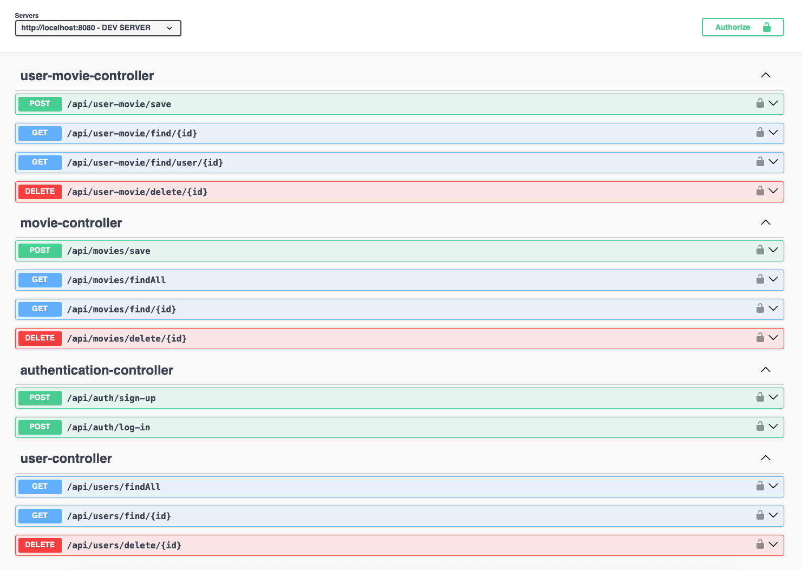

# 📦 Movie Tracker API

Esta API permite a los usuarios gestionar y realizar un seguimiento de las películas que han visto.
Pueden agregar, consultar su historial y eliminarlas de su lista.

API REST construida con **Spring Boot**, protegida con **JWT** y documentada usando **Swagger**.

---

## 🚀 🛠️ Tecnologías utilizadas

- Java 21
- PostgreSQL 17
- Spring Boot 3.4.4
- Spring Security 3.4.4
- JWT (JSON Web Tokens)
- Swagger / OpenAPI 2.8.6
- Maven 4.0.0

---

## 🔐 Autenticación

Está protegida con **JWT**.

1. Autenticarse en `/auth/login` con credenciales válidas.
2. Recibirás un **token JWT**.
3. Usa ese token como **Bearer Token** en el header `Authorization` para las demás peticiones.

## 📚 Swagger

Puedes explorar y probar la API desde **Swagger UI**:

http://localhost:8080/swagger-ui.html

